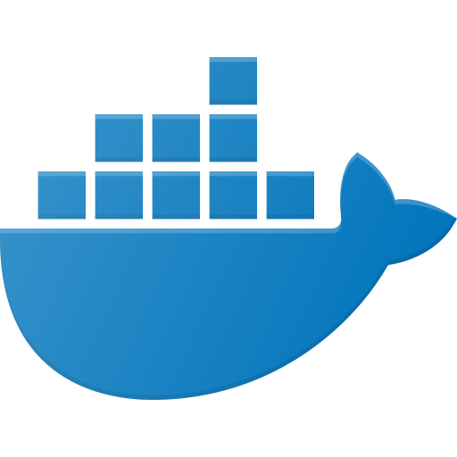

<h2 align="center">

</h2>

<h2 align="center"> 

 
<h2>Hey there  , I am <a>Kalkidan Siyum</a></h2>
 

I am a full-stack developer. Currently living in Ethiopia, Addis Ababa, I have a passion for learning and sharing my knowledge with others, and I love solving real-world problems.
<ul>
<li>
<g-emoji class="g-emoji" alias="seedling" fallback-src="https://github.githubassets.com/images/icons/emoji/unicode/1f331.png">🌱</g-emoji>
I'm currently learning Node.js</li>
<li>
<g-emoji class="g-emoji" alias="thinking" fallback-src="https://github.githubassets.com/images/icons/emoji/unicode/1f914.png">🤔</g-emoji>
I'm looking for new opportunity</li>
</ul>
 

 <h2>
    
 Languages and Tools
 </h2>

 
 

 

 

 

 

 
 
 
  

   
    
     
      

 

   
#  Github Stats

